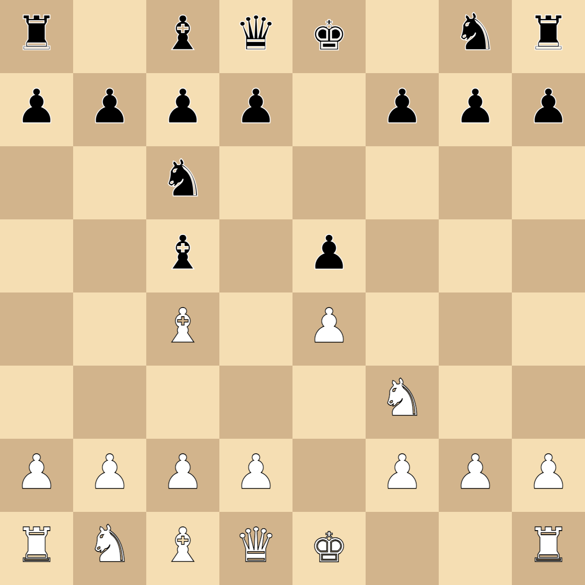

# lascacchiera

Si tratta di un piccolissimo tool per allenarsi a trovare le posizioni della scacchiera.

## Le feature

- Genera una posizione random
- Intercetta il click sulla scacchiera
- Se la cella corrisponde alla posizione mostra una faccina sorridente
- Se la cella non corrisponde alla posizione mostra una faccina triste

## Installazione

Alcune istruzioni su come installare il progetto

```bash
git clone https://github.com/sensorario/lascacchiera.git
cd lascacchiera
npm install
```

## Usage

E' incluso un server node, quindi per usare la scacchiera basta lanciare il comando ... L'opzione `-c1` serve per impostare la durata della cache ad 1 secondo perché in fase di sviluppo altrimenti diventa rognoso fare le modifiche.

```bash
http-server -c1
```

## Screenshot



## Contributing

Apri issue se qualche cosa non ti torna. Apri PR se vuoi anche personalizzare il progetto.
